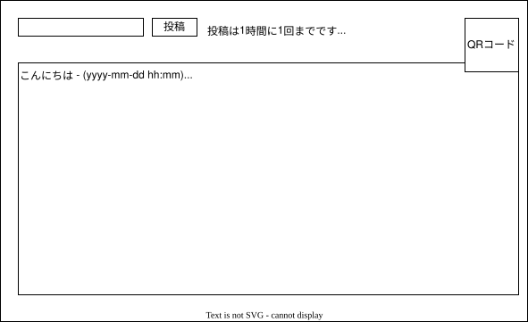

# CafeNote

Cloudflare Workers + D1 + KV + Pagesで構築された匿名掲示板システム

## 概要

CafeNoteは部屋ごとにコメント欄を設置できる匿名の掲示板システムです。QRコードでアクセスを簡単に共有でき、カフェやイベント会場でのゲストノートとして活用できます。

## 主な機能

### 基本機能
- 部屋ごとにコメント欄を設置でき、コメントの閲覧・投稿ができる
- 部屋IDを含むURLをQRコード化してページ内に表示
- スマホ・PC対応のレスポンシブデザイン
- ローカルQRコード生成（外部API不使用）

### 荒らし防止機能
- コメントは同一IPから1時間に1回まで（なのでコミュニケーションというよりは挨拶用）
- コメントは100文字まで
- HTMLタグ等は使えないようにする（XSS対策）
- Gemini APIに判定（rules.md）させて攻撃的なコメントは伏せて、個人情報と判断されたコメントは投稿前に警告を出して投稿を行わない

### Cloudflareの無料枠で収めるために
- frontend : Pagesで実装
- backend : Workers + D1 + KVで実装
- コメントはD1に記録、5分に1回D1からKVへのキャッシュ処理を実行、コメント一覧はKVから取得

## プロジェクト構成

```
cafenote/
├── backend/              # Cloudflare Workers API
│   ├── src/
│   │   ├── index.ts           # メインエントリポイント + Cron処理
│   │   ├── types.ts           # 型定義
│   │   ├── moderation.ts      # Gemini APIコンテンツモデレーション
│   │   ├── moderation-rules.ts # モデレーションルール定義
│   │   └── endpoints/
│   │       ├── getComments.ts # コメント取得API
│   │       └── postComment.ts # コメント投稿API
│   ├── schema.sql        # D1データベーススキーマ
│   ├── wrangler.jsonc    # Wrangler設定
│   └── README.md
├── frontend/             # Cloudflare Pages
│   ├── sample.html       # ゲストノートUI
│   └── README.md
├── README.md             # このファイル
├── DEPLOY.md             # デプロイ手順
└── main.drawio.svg       # 画面設計図
```

## セットアップ

詳細なデプロイ手順は [DEPLOY.md](./DEPLOY.md) を参照してください。

### 簡易セットアップ手順

1. **バックエンドのセットアップ**
   ```bash
   cd backend
   npm install
   wrangler d1 create guestbook-db
   wrangler d1 execute guestbook-db --file=./schema.sql
   wrangler kv:namespace create "COMMENT_CACHE"
   wrangler kv:namespace create "IP_LIMIT"
   wrangler secret put GEMINI_API_KEY
   npm run deploy
   ```

2. **フロントエンドのセットアップ**
   ```bash
   cd frontend
   # sample.htmlのAPI_URLを更新
   npx wrangler pages deploy . --project-name=guestbook
   ```

## api設計

### GET /{部屋ID}

KVから部屋ID内のコメント一覧をJSONで取得する

**レスポンス:**
```json
[
  {
    "id": "uuid",
    "message": "こんにちは！",
    "created_at": 1699999999999
  }
]
```

### POST /{部屋ID}

D1にコメントを追加する

**リクエスト:**
```json
{
  "message": "こんにちは！"
}
```

**レスポンス:**
```json
{
  "success": true,
  "id": "uuid",
  "warning": "軽度の不適切表現が検出されたため、内容は伏せられました。"
}
```

### バッチ処理

- D1からKVにコメント一覧をキャッシュするバッチ（5分ごとに実行）

## DB設計

### D1 SQL database

#### commentsテーブル

| カラム名 | 型 | 説明 |
|---------------|-----------|----------------------|
| id | TEXT | UUID |
| room_id | TEXT | 部屋ID |
| message | TEXT | コメント本文 |
| created_at | INTEGER 	| 作成日時 |
| ip_hash | TEXT | 投稿者のIPアドレスのハッシュ値 |

### Workers KV

1. コメント一覧表示用インスタンス
	- キー例：comment_cache:{room_id}
	- 値：最新コメントの配列（JSON）
	- TTL：5分

2. 書き込み制限インスタンス
	- キー例：ip_limit:{ip_hash}
	- 値：最終書き込みタイムスタンプ（UNIX）
	- TTL：1時間

## コンテンツモデレーション

Gemini APIを使用した3段階判定:

- **レベル1**: 問題なし → 通常投稿
- **レベル2**: 軽度の不適切表現 → 初期非表示（クリックで表示可能）
- **レベル3**: 重度の不適切表現・個人情報 → 投稿拒否

詳細は [backend/src/moderation-rules.ts](./backend/src/moderation-rules.ts) を参照。

## 画面設計



GETで取得したJSONをもとにコメント一覧を表示する。

## 使用ライブラリ

- [QRCode.js](https://davidshimjs.github.io/qrcodejs/) - QRコード生成ライブラリ (MIT License)

## ライセンス

このプロジェクトはMITライセンスの下で公開されています。
